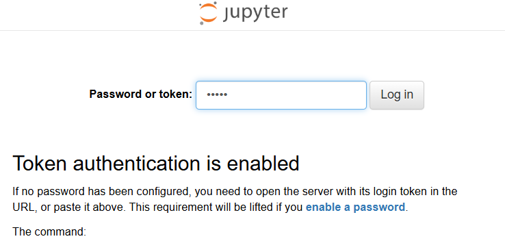

# [ Data-engineering ] NYC-Traffic-Collision
In this project we are going to build a data pipeline on 2 datasets regarding motor vehicle collision in NYC and holidays in the US.

The etl is developed in Pyspark.

2 notebooks are present:
- data_exploration: a notebook for checking data, cleaning and more in general exploring data.
- etl: a notebook where data is read in spark, cleaned, transformed, merged with other data, new kpis are created and aggregation performed

input dataset:
- workspace\dataset\Motor_Vehicle_Collisions_-_Crashes.csv
- https://date.nager.at/Api

The result dataset of the pyspark transformations performed is stored as parquet in:
- /output

To run the notebooks and reproduce the results you need to instantiate a docker container. The docker image is "jupyter/pyspark-notebook" that let you run a jupiter notebook with spark installed.
run:

`docker compose up -d`

Once the container is running reach the Jupiter UI at: http://localhost:8888/
you have to specify a "password or token", it is: "spark". Then click on "Log in"
